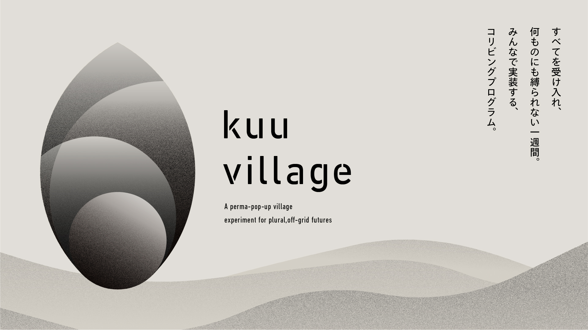

# kuu village

> ***A perma-pop-up village experiment for plural, off-grid futures***

[日本語版 / Japanese Version](README_JA.md)

## About us

**"空(kuu)"── A space that embraces everything, bound by nothing.**

**kuu village** is an initiative of **co-living program** where participants immerse themselves in the worldview of "kuu" through daily life. It serves as a living laboratory that combines an off-grid lifestyle with decentralized technologies to simultaneously explore autonomy, collaboration, and circularity. Participants let go of attachment to ownership and hierarchy, co-creating shelter, energy, water, food, and governance through their relationships with others. The insights and outcomes gained from this experience are shared as open source and passed on to the next community.

**kuu village is an experimental village where people experience "空-Kuu-" in different locations and pass on their insights like a baton to the next site.** In kuu village, a diverse group of participants from Japan and abroad stay locally for weeks. They engage in co-creation with the local community. The outcomes and learnings generated are shared openly, while also being rooted in the local area.

Each pop-up village continues to serve as a hub for both the participants and local residents even after the program ends, functioning semi-permanently. As the program travels from one location to the next, resilient communities and fields begin to emerge across regions—eventually growing into an interconnected network.

## Program Details of the first kuu village

- **Date:** October 1st ~ 7th
- **Location:** Tsukigase Village in Nara City

## 📜 5 Principles

1. **Shelter:** Practice a resilient off-grid life
2. **Nomadics:** Foster autonomy as individuals and networks
3. **Cosmolocalism:** Learn different wisdom between diverse communities
4. **Coordination:** Thrive together with respect for each differences
5. **Commons:** Share resources without depending on systems

## 💡 Themes

### Resilient Technology
Engage in practices that support off-grid living, such as energy, water, composting, architecture, and digital infrastructures

### Decentralized Governance
Experience decision-making processes while visualizing contributions and trust through DAO tools

### Diverse Network
Participate in a cross-disciplinary community where players from tech, local, and creative fields, as well as people from diverse cultural backgrounds intersect

### Self-transformation
Gain the opportunity to reset your values and ways of working by collaborating improvisationally with peers from diverse backgrounds in an open, flexible environment

### Governing the Commons
Contribute by recording outcomes and processes and sharing them with the world as open source

## 🗾 The First Field

**Nara City (the former Tsukigase Village)**

- A mountainous rural area located in the northeastern part of Nara Prefecture
- Merged into Nara City on April 1, 2005
- 6 communities, 494 households, Population: 1,171, Aging rate: 49.2% (as of May 1)
- Main local resources: tea, plum orchards
- Tsukigase Plum Grove is one of the first designated scenic spots in Japan

### Reference
[greenz.jp feature article: 行政に任せていた「自治」を、自分たちの手に取り戻そう。中山間地域の未来の暮らしのモデルをつくる「Local Coop 大和高原プロジェクト」の挑戦](https://greenz.jp/2025/02/27/local-coop-yamatokogen/)

---
