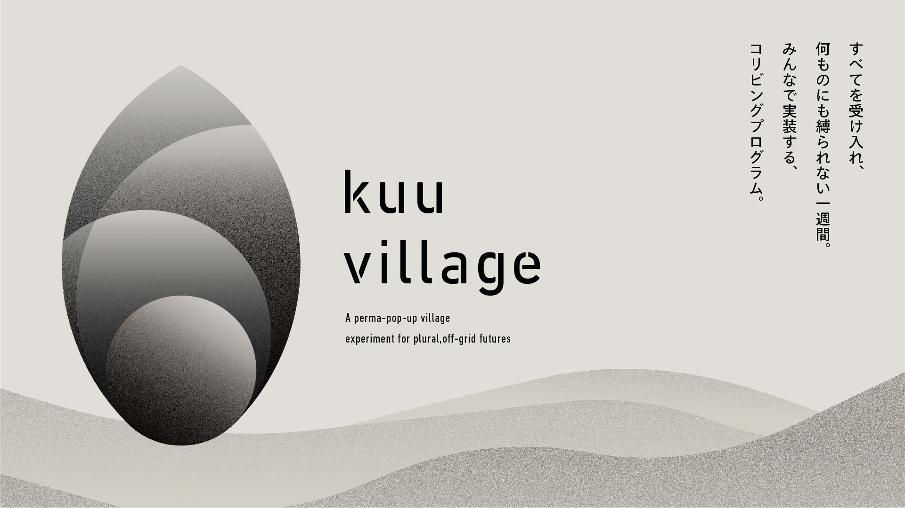

# kuu village

> ***多元的でオフグリッドな未来に向けての永続的なPopup Village***

## 私たちについて

**「空（kuu）」── すべてを受け入れ、何ものにも縛られない余白。**

**kuu village** は、この "空" の世界観を暮らしながら体感する**co-livingプログラム**。オフグリッドを志向した住環境や分散型テクノロジーを掛け合わせ、自律・協働・循環を同時に試す実験場となります。参加者は所有やヒエラルキーへの執着を手放し、関係性の中でシェルター・エネルギー・水・食・ガバナンスなどを自分たちの手で組み、そこで得た学びと成果はオープンソース化し、次の地域へ引き継いでいきます。

**また、kuu villageは「空-kuu-」を各地で体験し、知見を次の土地へ"バトン"する実験村です。** kuu villageには国内外の多様なプレイヤーがローカルに滞在し、用意されたクエストやDAOツールを介して地域コミュニティと共創します。生まれた成果と知見はオープンに公開しつつ、その土地に定着させていくことも求められます。

ポップアップで立ち上がった村は、プログラム後もプレイヤーと地元住民の拠点となり、半永久的に機能を継続。次の開催地へ巡回するたびに、レジリエンスの高いフィールドとコミュニティが各地に芽生え、やがて相互接続されたネットワークへと成長していきます。

## 第1弾プログラム詳細

- **日程:** 10月1日〜7日
- **場所:** 奈良市月ヶ瀬村

## 📜 5つの理念

1. **シェルター:** 回復力のあるオフグリッド生活を実践する
2. **ノマド:** 個やネットワークとしての自律性を育む
3. **コスモローカリズム:** 多様なコミュニティの叡智から学ぶ
4. **コーディネーション:** 互いの違いを尊重し、共に繁栄を目指す
5. **コモンズ:** 貨幣やシステム依存を超え、資源を共有する

## 💡 テーマ

### レジリエンス技術
エネルギー・水・コンポスト・建築・デジタルインフラなど、オフグリッド生活を支える実践をすることができる

### 分散型ガバナンス
DAOツールで貢献度と信頼を可視化しながら、意思決定プロセスを体感できる

### 多様なネットワーク
テック、ローカル、クリエイティブ分野のプレイヤー、様々な文化的背景のある人たちが交わる横断的コミュニティに参加できる

### 自己変容
余白ある環境で多様なバックグラウンドを持つ仲間と即興で協働し、価値観や働き方をリセットする機会が得られる

### コモンズへの参画
成果物とプロセスをアーカイブし、オープンソースとして世界に共有することで貢献できる

## 🗾 第1弾フィールド

**奈良県奈良市（旧月ヶ瀬村）**

- 奈良県北東部に位置する中山間地域
- 2005年4月1日に奈良市へ編入合併
- 6集落, 494世帯, 人口1,171人, 高齢化率49.2％（5月1日現在）
- 主な地域資源：茶、梅林
- 月ヶ瀬梅林は日本で初めての名勝地の1つ

### 参考記事
[greenz.jp 特集記事: 行政に任せていた「自治」を、自分たちの手に取り戻そう。中山間地域の未来の暮らしのモデルをつくる「Local Coop 大和高原プロジェクト」の挑戦](https://greenz.jp/2025/02/27/local-coop-yamatokogen/)

---
